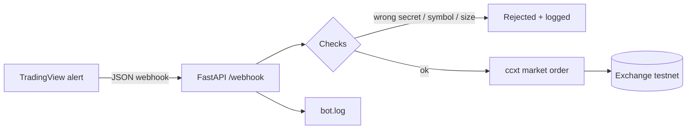

# TradingView Webhook Trading Bot

A small, safe Python bot that turns **TradingView alerts into exchange orders**.
When your Pine Script strategy fires an alert, TradingView sends a webhook to this
bot, the bot checks it, and places a market order on the exchange through [ccxt](https://github.com/ccxt/ccxt).

▶️ **[Watch the 3-minute demo on Loom](https://www.loom.com/share/20c982fddc53466fa879ae5c166cefae)**



## Features

- **Any ccxt exchange**: Binance, Kraken, Bybit and 100+ more, switched in one config line
- **Testnet first**: `sandbox: true` trades with fake money
- **Dry-run mode**: log alerts without placing any order
- **Safety checks on every alert**
  - shared secret, compared in constant time
  - allowlist of tradable symbols
  - maximum order size
  - strict validation of the alert body (side must be `buy` or `sell`)
- **Config, not code**: settings in `config.yaml`, secrets in `.env` (never committed)
- **Logging** of every received, rejected and executed alert to `bot.log`
- **Tested**: 10 automated tests with a fake exchange, no internet needed

## Project structure

```
├── bot/
│   ├── app.py          # FastAPI app: /webhook and /health
│   ├── config.py       # loads config.yaml + .env
│   └── exchange.py     # ccxt connection
├── scripts/
│   └── send_test_alert.py   # simulate a TradingView alert
├── tests/
│   └── test_webhook.py
├── config.yaml         # bot settings (no secrets)
├── .env.example        # template for your secrets
└── main.py             # start the server
```

## Quick start

```bash
git clone https://github.com/wrvgaalen-bit/tradingview-webhook-bot.git
cd tradingview-webhook-bot
python -m venv .venv
.venv\Scripts\activate          # Windows
# source .venv/bin/activate     # macOS / Linux
pip install -r requirements.txt
```

Copy `.env.example` to `.env` and fill in your testnet API keys and a long random `WEBHOOK_SECRET`.
Then start the bot:

```bash
python main.py
```

Check it is running: open http://127.0.0.1:8000/health

## Try it without TradingView

In a second terminal:

```bash
python scripts/send_test_alert.py buy                       # places a testnet order
python scripts/send_test_alert.py sell --amount 0.002
python scripts/send_test_alert.py buy --secret wrong        # rejected: 401
python scripts/send_test_alert.py buy --symbol DOGE/USDT    # rejected: not allowed
python scripts/send_test_alert.py buy --amount 5            # rejected: above max
```

## Configuration

| Setting | Where | Meaning |
| --- | --- | --- |
| `exchange.id` | config.yaml | ccxt exchange id, e.g. `binance`, `kraken` |
| `exchange.sandbox` | config.yaml | `true` = testnet with fake money |
| `trading.dry_run` | config.yaml | `true` = log only, never place orders |
| `trading.allowed_symbols` | config.yaml | symbols the bot may trade |
| `trading.default_amount` | config.yaml | order size when the alert has no amount |
| `trading.max_amount` | config.yaml | larger orders are rejected |
| `server.host` / `port` | config.yaml | `0.0.0.0` on a server, `127.0.0.1` locally |
| `EXCHANGE_API_KEY` / `EXCHANGE_API_SECRET` | .env | exchange keys |
| `WEBHOOK_SECRET` | .env | shared secret in every alert (16+ characters) |

## Connecting TradingView

1. Run the bot on a server with a public HTTPS address (TradingView only sends to ports 80 and 443).
2. Webhook alerts need a paid TradingView plan (Essential or higher) and two-factor authentication.
3. Create an alert on your strategy, set the webhook URL to `https://your-server/webhook`
   and use this message:

```json
{
  "secret": "your-webhook-secret",
  "symbol": "BTC/USDT",
  "side": "{{strategy.order.action}}",
  "amount": 0.001
}
```

TradingView fills in `{{strategy.order.action}}` with `buy` or `sell` automatically.

## Run the tests

```bash
python -m pytest
```

## Safety notes

- Develop on a **testnet**. Only switch `sandbox` to `false` when you fully trust the setup.
- Create API keys **with trading rights only, never withdrawal rights**.
- Keep `.env` out of version control (already in `.gitignore`).
- This software executes your strategy; it does not make it profitable. Use at your own risk.

## License

MIT
